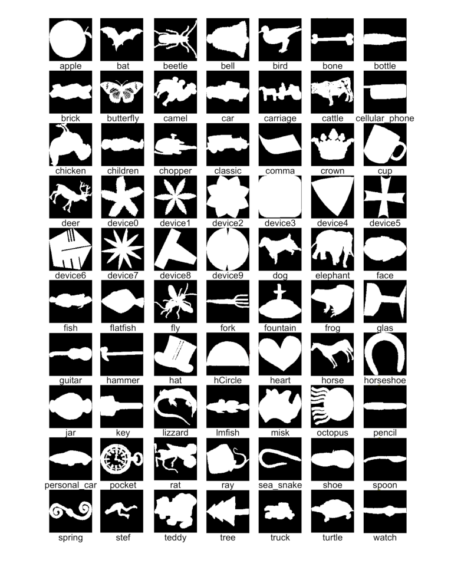
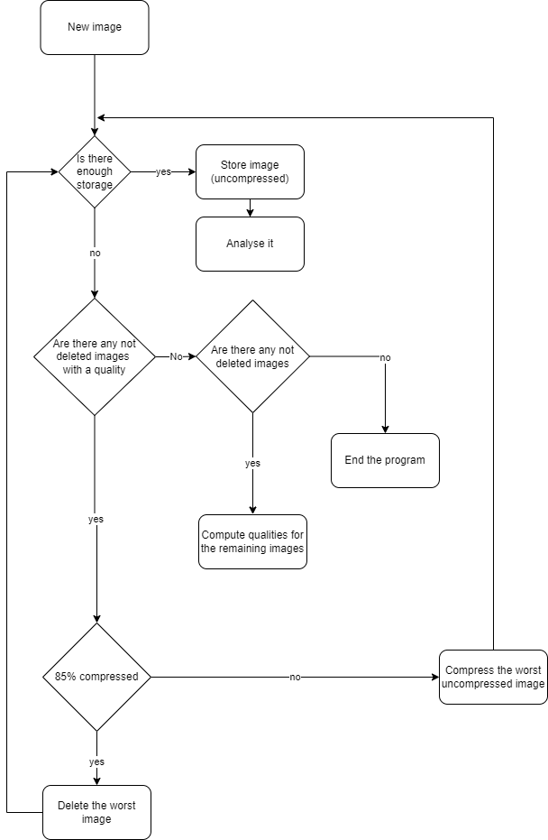

# DeepCream - code documentation

In this documentation file we will explain the approach and development process
of each module in short. The technical details of the execution can be found in
the code which has lots of comments closely explaining the individual lines of
code.

## Cloud detection

The original idea for the cloud detection was using the OpenCV library together
with a smart algorithm to filter the clouds out by their HSV values. However,
this method soon turned out to be too unreliable on its own with is why we
trained an AI to assist it.

The AI is based on the U-Net Model which proved to be a good choice, delivering
promising results from the start. The problem with this approach was that it
required training data where the cloud masks would have to be made by hand
which would have taken multiple hours.

Luckily we were able to automate this process
using [Apeer](https://www.apeer.com/home/) which is an automated image analysis
originally meant for biotechnology but which is also a great solution for
segmenting clouds in satellite images. With this tool we only had to annotate
about a dozen photos and were able to generate the remaining masks easily and
quickly.

Through this unexpected success the AI became so good that it rendered the HSV
analysis basically useless, which allowed us to cut it from the cloud detection
module, reducing the processing time per image by over 70%!

Source: https://lmb.informatik.uni-freiburg.de/people/ronneber/u-net/

## Scientific application

The scientific approach is split into two distinct parts: The analysis, which
separates clouds on the provided image and computes a variety of properties for
each one. The classification part takes these features and generates
probabilities for each cloud type.

### Cloud analysis

The first part of the analysis consists of the separation of the clouds. These
are mostly considered independent. The second part of the analysis identifies a
couple of features that can indicate the type of the cloud. These features
consist of shape based features, for example the elongation or the convexity,
and texture based features, like transparency and sharp edges.

### Classification

At first, we thought about implementing a clustering algorithm to identify the
different clouds. This would have had the disadvantages of consuming a lot of
computation time and resulting in barely predictable results. So instead we
compute the classification by comparing the properties gathered by the analysis
against a couple of cloud types previously defined. This allows us to quickly
customise and specify new cloud types and correct classification mistakes made
by the program, while maintaining a high performance.

## Pareidolia

In this part of our project, we attempted to simulate the phenomenon of
pareidolia. Pareidolia is the tendency for perception to impose a meaningful
interpretation on a nebulous stimulus, usually visual, so that one sees an
object, pattern, or meaning where there is none
(Source: [Wikipedia](https://en.wikipedia.org/wiki/Pareidolia)).

To achieve this, we used the MPEG-7 dataset to train a neural network that can
classify shapes of more than 50 different everyday objects using binary masks.
To train the AI we
used [Teachable Machine](https://teachablemachine.withgoogle.com/).

Source: https://www.researchgate.net/profile/Joao-Nunes-29/publication/245251999/figure/fig4/AS:668849762492443@1536477618671/The-MPEG-7-Core-Experiment-CE-Shape-1-dataset.png

## Database

Because we wanted to be able to restart the program multiple times, a proper
database was needed. At first, we wanted to implement a relational database
because of the ease of sqlite3 in python, but then we quickly realized that a
document based database would yield far better results. As systems like MongoDB
are not installed on the astropi, we implemented a database ourselves. More
concretely it is a wrapper around a folder structure described more detailed in
the docstrings of the module. It handles all in- and output to the file system,
allowing a concise interface in the other modules.

Because the allowed space of 3GB is not enough to store all images in full
resolution, we implemented a smart algorithm to select images which are less
relevant to our program and compress and delete them if necessary. The
so-called quality determines how confident the algorithms are about an image
(i.e. they are very sure that a cloud is of a specific type or looks very
similar to a specific object). Note that only the original images taken by the
camera are considered for compression or deletion. No output of the scientific
or artistic approach is deleted, and no image is compressed or deleted which is
not fully analysed. Below you can see a flow chart of this algorithm:

Everytime an image is to be saved, the remaining space is checked. If there is
not enough space to store the image, then the free_space method takes place.
When there are any not deleted images, then the ration of the already
compressed images to the not compressed nor deleted ones is determined. This
ensures that the images, for which the classification and pareidolia are very
confident, are not compressed unless there is no other choice. If 85% are
compressed, then the image with the lowest quality is deleted, otherwise
deleted. If there are no not deleted images with a quality, but there are
images without, then a signal i.e. an error is raised which urges the program
to slow the taking of images down until more qualities are computed. In the
unlikely scenario, that the csv's and masks use more space than 3GB, the
program is stopped.

## main.py

The main.py is comparatively simple as it just needs to instance the DeepCream
module and start it. It does this in a while loop so that the program is
guaranteed to run the full three hours. In the case of an error it catches any
exceptions and logs them. After that it reinitialized the DeepCream model.

Note: Since the program uses multiple threads the individual threads might and
will exceed the allowed runtime they are given. To counteract this we subtract
two minutes off of this runtime to ensure the threads will finish in time.